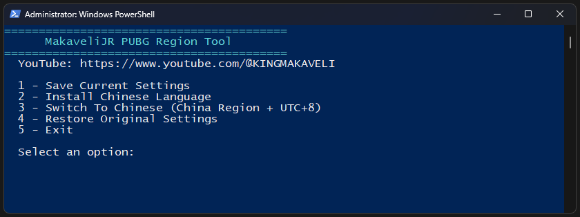

# MakaveliJR PUBG Region Tool



PowerShell utility for Windows 10/11 that backs up and restores regional settings commonly used when switching regions for games such as PUBG.

## Features

- Automatic Administrator elevation
- Save current Windows regional settings to a backup file
- Restore saved settings
- Time zone handling
- UI language handling
- System locale handling
- User language list backup/restore
- Keyboard layout backup/restore

## Requirements

- Windows 10 or Windows 11
- PowerShell 5.1 or newer
- Administrator privileges

## Usage

1. Right-click PowerShell and choose **Run as Administrator** (or allow elevation when prompted).
2. Run:

```powershell
./MakaveliJR-PUBG-Region-Tool.ps1
```

3. Follow the on-screen menu/options.

## Backup Location

The script stores backups in:

```text
%USERPROFILE%\MakaveliJR_backup.json
```

## Disclaimer

Use at your own risk. Review the script before running it and ensure you understand any changes it makes to Windows regional, language, and keyboard settings.

## Author

MakaveliJR
